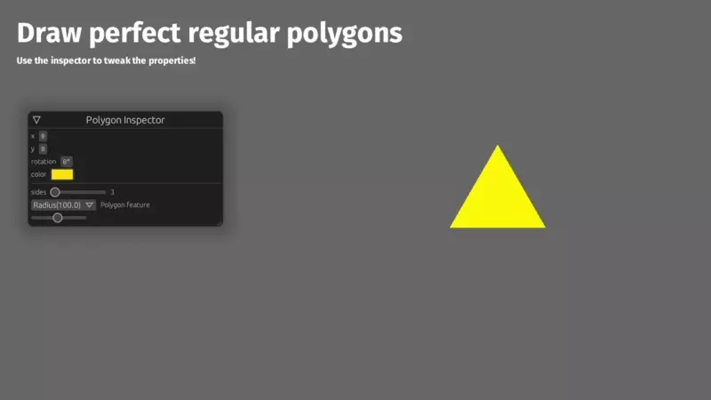

# Bevy + Lyon = ❤

[](https://crates.io/crates/bevy_prototype_lyon)
[](LICENSE)
[](https://crates.io/crates/bevy_prototype_lyon)
[](https://github.com/Nilirad/bevy_prototype_lyon)
[](https://github.com/Nilirad/bevy_prototype_lyon/actions/workflows/ci.yml)

`bevy_prototype_lyon` enables [**Bevy**](https://bevyengine.org) users to draw 2D shapes and paths, like triangles, circles, rectangles, lines, arcs and beziers.

[**Try out the live demo!**](https://nilirad.github.io/bevy_prototype_lyon_showcase/)


## How does it work?

Currently Bevy does not support drawing custom shapes in an easy way. This crate uses a variation of Bevy's `SpriteBundle` with custom meshes to draw shapes. The [**lyon**](https://docs.rs/lyon_tessellation) crate is used to generate those custom meshes.

## Usage

Add `bevy_prototype_lyon` to your cargo project:

```shell
cargo add bevy_prototype_lyon
```

Then, you can start by drawing simple shapes:

```rust
use bevy::{color::palettes::css::*, prelude::*};
use bevy_prototype_lyon::prelude::*;

fn main() {
    App::new()
        .add_plugins((DefaultPlugins, ShapePlugin))
        .add_systems(Startup, setup_system)
        .run();
}

fn setup_system(mut commands: Commands) {
    let shape = shapes::RegularPolygon {
        sides: 6,
        feature: shapes::RegularPolygonFeature::Radius(200.0),
        ..shapes::RegularPolygon::default()
    };

    commands.spawn((Camera2d, Msaa::Sample4));
    commands.spawn(
        ShapeBuilder::with(&shape)
            .fill(DARK_CYAN)
            .stroke((BLACK, 10.0))
            .build(),
    );
}
```

Don't forget to check out the [examples](https://github.com/Nilirad/bevy_prototype_lyon/tree/latest/examples) to learn more!

## Bevy versions supported

I strive to support the latest version of Bevy. Support for a version of Bevy is dropped as soon as a new one is released.

The following table shows the latest version of `bevy_prototype_lyon` that supports a certain version of Bevy.

|bevy|bevy_prototype_lyon|license|
|---|---|---|
|0.15|0.13|MIT/Apache 2.0|
|0.14|0.12|MIT/Apache 2.0|
|0.13|0.11|MIT/Apache 2.0|
|0.12|0.10|MIT/Apache 2.0|
|0.11|0.9|MIT/Apache 2.0|
|0.10|0.8|MIT/Apache 2.0|
|0.9 |0.7|MIT/Apache 2.0|
|0.8 |0.6|MIT/Apache 2.0|
|0.7 |0.5|MIT/Apache 2.0|
|0.6 |0.4|MIT/Apache 2.0|
|0.5 |0.3|MIT|
|0.4 |0.2|MIT|

***

### License

Licensed under either of

 * Apache License, Version 2.0, ([LICENSE-APACHE](LICENSE-APACHE) or http://www.apache.org/licenses/LICENSE-2.0)
 * MIT license ([LICENSE-MIT](LICENSE-MIT) or http://opensource.org/licenses/MIT)

at your option.

### Contribution

Unless you explicitly state otherwise, any contribution intentionally submitted
for inclusion in the work by you, as defined in the Apache-2.0 license, shall be dual licensed as above, without any
additional terms or conditions.
